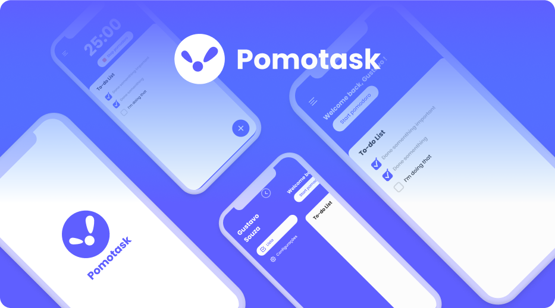

<h1 align="center">
    
</h1>

<p align="center">
  <a href="#-technologies">Technologies</a>&nbsp;&nbsp;&nbsp;|&nbsp;&nbsp;&nbsp;
  <a href="#-project">Project</a>&nbsp;&nbsp;&nbsp;|&nbsp;&nbsp;&nbsp;
  <a href="#-layout">Layout</a>&nbsp;&nbsp;&nbsp;
</p>

<br>

<p align="center">
  
</p>

## Test on your machine

First, install the dependecies:

```bash
npm install
# or
yarn

```

Second, run the command line:

```bash
npm start
# or
yarn start
```

Open the [Expo app](https://play.google.com/store/apps/details?id=host.exp.exponent) with your phone to see the result.

## 🚀 Technologies

This project is developed with the technologies below:

- [React Native](https://reactnative.dev/)
- [Expo](https://expo.dev/)
- [TypeScript](https://www.typescriptlang.org/)
- [Moti](https://moti.fyi/)
- [React Native Reanimated](https://docs.swmansion.com/react-native-reanimated/)
- [React Navigation](https://reactnavigation.org/)
- [Native Base](https://nativebase.io/)
- [Styled-Components](https://styled-components.com/)

## 💻 Project

The first version of my To-do list app! 

This is my To-do app with a pomodoro app to help me focus on my work tasks and studies.
If you like it and it helped you let me know at my [LinkedIn](https://www.linkedin.com/in/gustavo-silva-261415148/)

## 🔖 Layout

You can visualize the project with the link below:

- [Mobile UI](https://www.figma.com/file/cjWiZK043PLbByll4BwW5f/PomoTask?node-id=6%3A3641) 

<p align="center">Developed by Gustavo Souza with 💜</p>